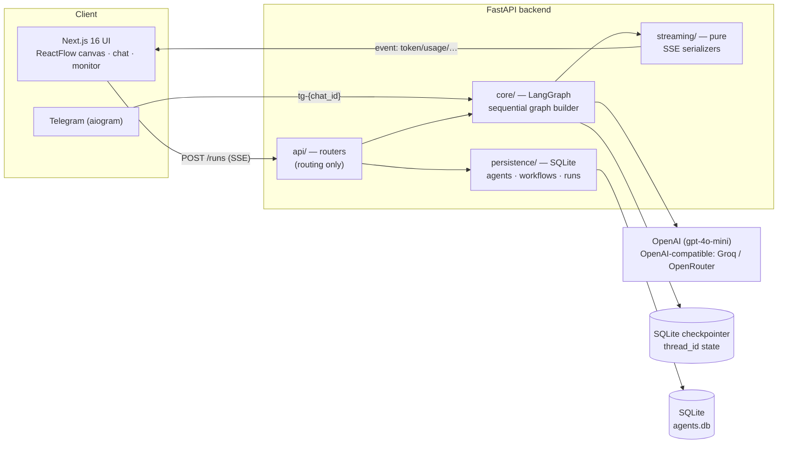

# AI Agent Orchestration Platform

Create agents, configure them, wire them into multi-agent workflows, run them
live from a visual web UI, and talk to them through a Telegram bot — with
per-token streaming, live cost tracking, and durable per-thread memory shared
across channels.

---

## Architecture



**Layer separation (enforced):** `api/` is HTTP routing only · `core/` owns all
LangGraph construction · `persistence/` is the only DB access · `streaming/` is
pure SSE serialization · the frontend has zero business logic (fetch, render,
stream).

**Request flow:** the UI `POST`s to `/runs`; the API builds (and caches) a
compiled graph from the workflow's DB rows, streams it with
`stream_mode=["updates","messages","custom"]`, and forwards typed SSE events
(`node_start`, `token`, `agent_message`, `usage`, `node_end`, `done`, `error`).
The same graph + the same `thread_id` powers the Telegram bot, so a
conversation started on Telegram (`tg-<chat_id>`) continues in the web UI with
full history (LangGraph SQLite checkpointer).

---

## Tech Stack

| Layer            | Choice                                   |
|------------------|------------------------------------------|
| Agent runtime    | LangGraph 1.2 (sequential `StateGraph`)  |
| LLM              | OpenAI `gpt-4o-mini` via `langchain-openai` (provider-pluggable: OpenAI / Groq / OpenRouter) |
| Backend          | FastAPI 0.136, `uv`, Python 3.12         |
| Persistence      | SQLite — SqliteSaver (checkpoints) + SQLAlchemy (agents/workflows/runs) |
| Telegram         | aiogram 3.28 (polling **or** webhook)    |
| Frontend         | Next.js 16 (App Router), Tailwind 4, Zustand 5 |
| Graph editor     | @xyflow/react 12.10                      |
| Tests            | pytest + httpx ASGI (LLM stubbed)        |

---

## Setup

### Option A — Docker (one command)

```bash
cp .env.example .env          # fill in OPENAI_API_KEY (+ optional keys)
docker compose up             # backend :8000, frontend :3000
```

Open http://localhost:3000.

### Option B — Local dev

```bash
# Backend
cd agent-platform/backend
uv venv --python 3.12 && uv pip install -r pyproject.toml --extra dev
uv run uvicorn main:app --port 8000

# Frontend (new terminal)
cd agent-platform/frontend
pnpm install
echo "NEXT_PUBLIC_BACKEND_URL=http://localhost:8000" > .env.local
pnpm dev
```

### Environment

`.env` lives at the repo root (loaded regardless of process CWD). See
`.env.example` — only an LLM key is required:

- `OPENAI_API_KEY` (recommended; spec-intended, reliable tool-calling).
  `OPEN_AI_API_KEY` is also accepted.
- Alternatively `GROQ_API_KEY` or `OPENROUTER_API_KEY` (free tiers; provider is
  auto-selected, precedence OpenAI > OpenRouter > Groq).
- `TELEGRAM_BOT_TOKEN` + `TELEGRAM_MODE=polling|webhook` (bot gracefully
  disables if unset).

---

## Tests

```bash
cd agent-platform/backend && uv run pytest tests/
```

15 tests, isolated temp SQLite, **no real LLM calls** (graph stubbed). Covers
agent CRUD/soft-delete, template seeding, topology, clone, the SSE endpoint +
run persistence, serializer dispatch, and cost estimation.

---

## Key Design Decisions & Trade-offs

**Sequential graph instead of `langgraph-supervisor` handoffs.** The spec's
Supervisor pattern relies on the LLM *choosing* to call `transfer_to_<agent>`
tools. Empirically — across Groq, OpenRouter, and OpenAI, with many prompt
variations — that decision is non-deterministic (~60–70% reliable); the
researcher would often answer directly and the writer never ran. For a
demo-critical (40%) feature this is unacceptable, so workflows are built as a
deterministic `StateGraph` with **fixed edges** (`supervisor → agent[0] →
agent[1] → END`). A lightweight no-LLM `supervisor` node is kept as the canvas
entry point and thread anchor. CLAUDE.md explicitly sanctions this deviation
("supervisor only is fine; justify in README"). 100% reliable; same SSE,
checkpointer, and topology contracts.

**Provider-pluggable LLM.** CLAUDE.md's pinned `langgraph==1.1.10` and
`langchain==1.3.0` are mutually incompatible (langchain 1.3 needs
langgraph ≥1.2); langgraph was relaxed to 1.2. The LLM client is OpenAI-
compatible, so OpenAI / Groq / OpenRouter all work via base-URL switching;
OpenAI is preferred for reliability, free providers are supported for zero-cost
runs (cost counter correctly shows `$0.00` for `:free` models).

**SSE everywhere, never polling.** Live tokens, per-node status (canvas
highlight), inter-agent messages (monitor drawer), and token/cost all flow over
one SSE stream. `stream_usage=True` is required for OpenAI to report tokens.

**Designed, not implemented (cut per CLAUDE.md priority order):** agent
guardrails UI, cron scheduling, peer-to-peer swarm handoff, in-canvas
conditional branching, human-in-the-loop approval modal.

---

## Demo Script (≈3 min)

1. Dashboard — two preloaded templates (Research & Write, Customer Support).
2. Open **Research & Write** — canvas shows Supervisor → Researcher → Writer.
3. Run a prompt ("Write a brief report on LangGraph 1.0").
4. Watch nodes pulse in order; tokens stream into the chat; token/cost counter
   increments live.
5. Open the monitor drawer — inter-agent messages (routing + researcher notes +
   writer report).
6. Send the same prompt to the Telegram bot — response streams back (throttled).
7. In the web UI, the run appears under **Runs** with the `tg-…` thread.
8. Continue that `thread_id` from the web UI — prior context is recalled
   (SQLite checkpointer).
9. (If `LANGCHAIN_API_KEY` set) inspect the LangSmith trace for token/cost.

> Demo GIF: _add link_ · LangSmith trace: _add link_

---

## Repository Layout

```
agent-platform/
├── backend/   api · core · tools · persistence · streaming · telegram · tests
└── frontend/  app (App Router) · components (canvas/chat/monitor) · lib
DESIGN.md · docker-compose.yml · .env.example
```
